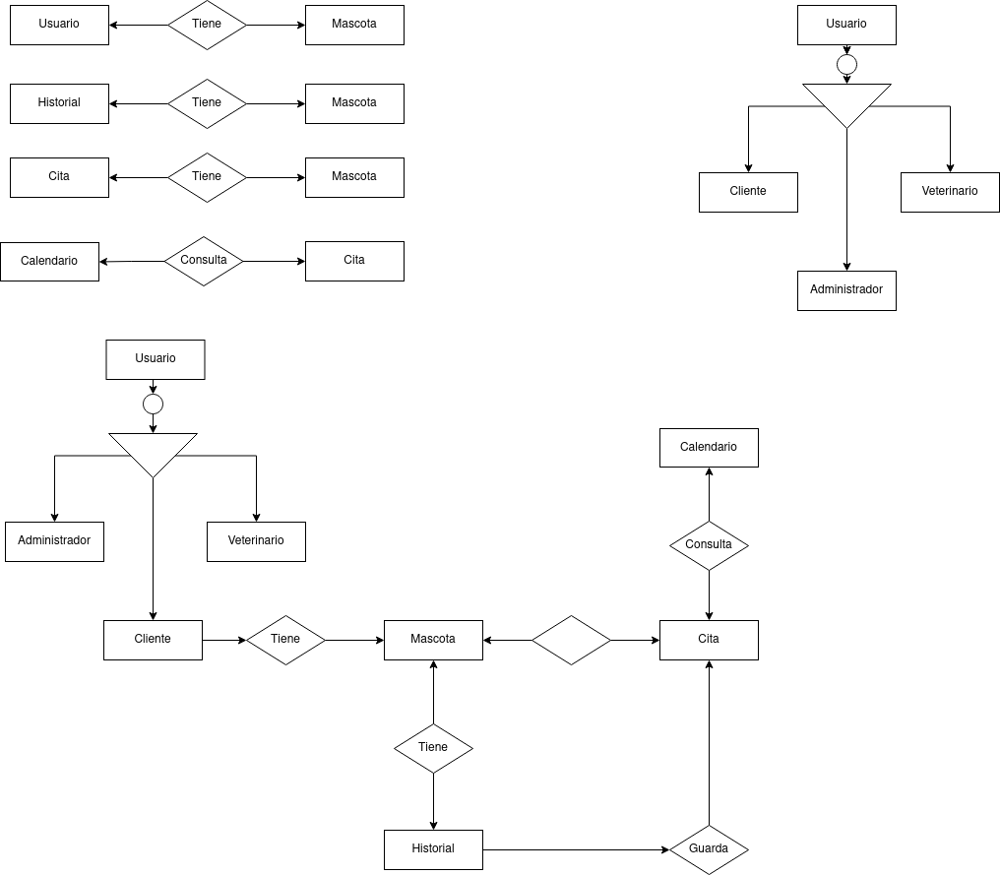
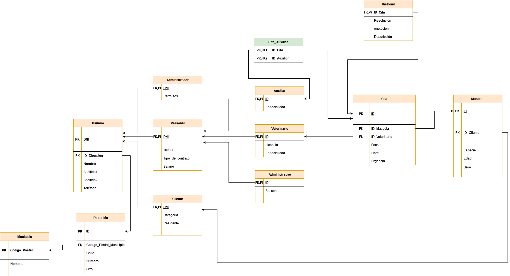

# Clínica Veterinaria

## Objetivos del proyecto

 

El objetivo general de este proyecto es el desarrollo de una aplicación web, que facilite la gestión de una clínica veterinaria, permitiendo a los usuarios un mejor alcance y organización de la información a la hora de gestionar los datos de las mascotas y de los dueños de estás.

Este objetivo general, se pretende que los usuarios puedan ejercer distintos roles tales como administradores y usuarios, que pueden ser:

* Gestión de roles: los usuarios puedan ejercer distintos roles tales como administradores y usuarios. Los administradores contarán con total acceso a la aplicación pudiendo dar permisos para acceder a los usuarios. 
* Historial, que consiste en tener un seguimiento de las consultas realizadas y las fechas, que se han hecho en la clínica.
* Listado de las mascotas, tener un listado de las mascotas que están registradas en la clinica.
* Listado de los clientes, un registro de cada cliente, donde se podrá añadir, modificar y borrar los datos que se consideren, en caso de que los clientes se den de baja o si surgen nuevos clientes.
* Calendario, tener un seguimiento de las citas disponibles y los días cuyo cupo está lleno.

## Temática del proyecto

La temática de este proyecto es médica, ya que es sobre una clinica para la atención de mascotas domésticas.

## Prototipo del proyecto

 
 Está es la ventana principal de nuestra aplicación que nos va a permitir logearnos si ya estamos registrados, si queremos registrarnos solo tenemos que pulsar en el botón de registrar que nos redigirá, al formulario de registro de un usuario nuevo, si por el contrario estamos logeados e iniciamos sesión nos redigirá al panel de gestión.

  Está es la ventana de registro de un usuario nuevo, donde introduciendo los datos del usuario y los más importante, en el select rol, habra dos tipos de usuarios empleados y administradores, que tendrán ciertos previlegios a la hora de gestionar la aplicación, una vez registrado los datos, nos redigirá al panel de gestión.

   Está es la ventana de panel de gestion, donde el usuarios tendrá varias opciones para la gestión de la clínica.

   Está es la ventana de panel de roles, donde se podrá gestionar los datos personales de cada usuario.

   Está es la ventana de listado de clientes, donde el usuario podrá gestionar los datos de los clientes, modificar, crear, buscar o eliminar un cliente.

   Está es la ventana de listado de mascotas donde tendremos todas las mascotas registradas de la clínica.

   Está es la ventana que muestra el calendario de citas disponibles o ocupadas de la clinica, donde el usuario podra crear, editar o eliminar una cita.

  Está es la ventana de historial, donde se muestra un listado del seguimiento de las consultas realizadas de los pacientes de la clínica.

## Solución 
 

      
Modelo Entidad Relación

      

        
      

      

      
Modelo Relacional

      

        
      

 

      
Justificación de las formas normales

      

       
### Primera forma normal
       
Para cumplir con la primera forma normal los atributos de las tablas deben ser atómicos. En nuestro caso esto se cumple ya que no existen atributos con varios valores dentro de la misma celda
o atributos suceptibles a ser separados en tablas diferentes.

### Segunda forma normal
     
La segunda forma normal se cumplirá solo cuando se haya cumplido la primera y todos los atributos que no formen parte de la clave primaria tengan dependencia funcional completa con ella.
En nuestro caso la segunda forma normal también se cumple ya que no existen atributos en las tablas que no guarden relación con la clave principal de la misma.
       
### Tercera forma normal
       
Por último la tercera forma normal solo se cumplirá se se cumplen las dos anteriores y no exista transitividad. En las tablas de este proyecto no existe tal transtividad, un ejemplo donde esto podría ocurrir y que está controlado
es el caso de la dirección ya que si esta se encontrara dentro del usuario no se cumpliria esta forma normal.

- <a href='sql/random.sql'>procedimientos,funciones,vistas, índices y triggers</a>
- <a href='sql/proyecto.sql'>tablas</a>
- <a href='sql/calls.sql'>creación de base de datos con llamadas a los procedimientos</a>

